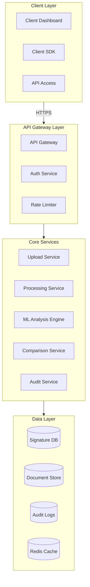

# Break down to build a signature validation platform that other businesses can integrate into their workflows. Let's approach this systematically.

1. Core Value Proposition
- Automated verification of handwritten signatures against known samples
- Reduce fraud, streamline document processing
- Make it accessible via API for any business to integrate

2. Key Technical Architecture Components:
```
A. Front-end Services
- Signature capture API/SDK
- Document upload interface
- Client dashboard for management
- Developer portal & documentation

B. Core Backend Services
- Authentication/Authorization service
- Signature analysis engine
   - Feature extraction
   - Pattern matching
   - Machine learning models
- Document processing service
- API gateway
- Event streaming service

C. Storage & Database
- Signature database (versioned)
- Document store
- Audit logs
- User management
```

3. MVP Features to Build First:
```
Phase 1 (3-4 months):
- Single signature validation API endpoint
- Basic dashboard for customers
- Simple signature storage & comparison
- Authentication system
- Usage tracking

Phase 2 (2-3 months):
- Batch processing capabilities
- Enhanced ML models
- Audit trails
- Developer documentation
- API rate limiting & throttling
```

4. Go-to-Market Strategy:
```
Initial Target Markets:
- Financial institutions
- Legal services
- Healthcare providers
- Government contractors
- Real estate agencies

Pricing Model:
- Freemium API access (up to 100 validations/month)
- Tiered pricing based on:
  - Monthly API calls
  - Storage requirements
  - SLA requirements
```

5. Development Approach:




6. Initial Development Sprint Plan:
```
Sprint 1-2:
- Set up core infrastructure
- Basic API gateway
- Simple signature upload & storage

Sprint 3-4:
- Implement basic ML model
- Create comparison algorithm
- Build basic dashboard

Sprint 5-6:
- Add authentication
- Implement usage tracking
- Create basic documentation

Sprint 7-8:
- Beta testing
- Security audits
- Performance optimization
```

7. Key Technical Considerations:
- Use containerization (Docker) for all services
- Implement robust error handling
- Build comprehensive logging
- Ensure GDPR and data privacy compliance
- Plan for horizontal scaling
- Implement robust security measures

8. Success Metrics:
```
Technical:
- API response time < 200ms
- 99.9% uptime
- < 1% false positives
- < 0.1% false negatives

Business:
- Monthly Recurring Revenue (MRR)
- API usage growth
- Customer retention rate
- Integration time for new customers
```

Would you like me to expand on any of these areas? I can provide more detailed information about specific components, such as the ML model architecture, API design, or pricing strategy.
