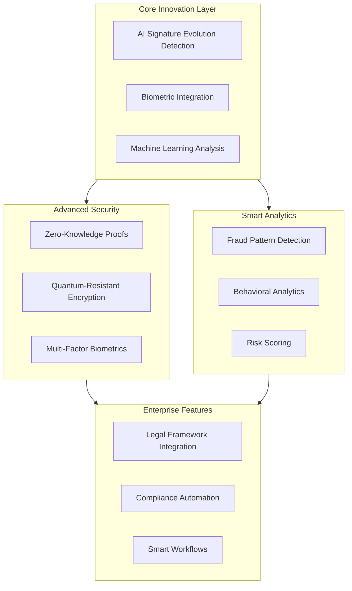

Let me suggest innovative features that would make this signature validation platform stand out significantly.




1. Advanced AI Features:
```
a) Signature Evolution Analysis
   - Track how signatures change over time
   - Detect natural vs. suspicious changes
   - Age/health-related variation allowance

b) Context-Aware Validation
   - Consider document type
   - Time and location patterns
   - User behavior patterns

c) Multi-Modal Biometric Integration
   - Pressure sensitivity analysis
   - Writing speed patterns
   - Hand tremor analysis
```

2. Security Innovations:
```
a) Zero-Knowledge Proofs
   - Verify without exposing actual signatures
   - Privacy-preserving comparison
   - Regulatory compliance

b) Quantum-Resistant Encryption
   - Future-proof security
   - Post-quantum cryptography
   - Hybrid classical-quantum approach

c) Behavioral Biometrics
   - Device movement patterns
   - Typing rhythms
   - Gesture analysis
```

3. Legal Tech Integration:
```
a) Smart Contract Automation
   - Auto-generate legal certificates
   - Court-admissible validation reports
   - Jurisdiction-specific compliance

b) Regulatory Compliance Engine
   - GDPR compliance
   - eIDAS regulation support
   - FDA CFR Part 11 compliance
```

4. Enterprise Features:


```tsx
import React from 'react';
import { Card, CardHeader, CardTitle, CardContent } from '@/components/ui/card';
import { LineChart, Line, XAxis, YAxis, Tooltip } from 'recharts';
import { Shield, Users, AlertTriangle, CheckCircle } from 'lucide-react';

const EnterpriseFeatures = () => {
  const fraudData = [
    { month: 'Jan', attempts: 12, prevented: 12 },
    { month: 'Feb', attempts: 15, prevented: 15 },
    { month: 'Mar', attempts: 8, prevented: 8 },
    { month: 'Apr', attempts: 20, prevented: 20 }
  ];

  return (
    <div className="p-6 space-y-6">
      <div className="grid grid-cols-1 md:grid-cols-2 lg:grid-cols-4 gap-4">
        <Card>
          <CardHeader className="space-y-1">
            <CardTitle className="text-2xl font-bold flex items-center">
              <Shield className="mr-2 text-green-500" />
              Security Score
            </CardTitle>
          </CardHeader>
          <CardContent>
            <div className="text-4xl font-bold text-green-500">98.5%</div>
            <div className="text-sm text-gray-500">Quantum-secured</div>
          </CardContent>
        </Card>

        <Card>
          <CardHeader className="space-y-1">
            <CardTitle className="text-2xl font-bold flex items-center">
              <AlertTriangle className="mr-2 text-orange-500" />
              Risk Analysis
            </CardTitle>
          </CardHeader>
          <CardContent>
            <div className="text-4xl font-bold text-orange-500">Low</div>
            <div className="text-sm text-gray-500">Based on AI analysis</div>
          </CardContent>
        </Card>

        <Card>
          <CardHeader className="space-y-1">
            <CardTitle className="text-2xl font-bold flex items-center">
              <Users className="mr-2 text-blue-500" />
              Active Users
            </CardTitle>
          </CardHeader>
          <CardContent>
            <div className="text-4xl font-bold text-blue-500">2.4K</div>
            <div className="text-sm text-gray-500">Across 15 countries</div>
          </CardContent>
        </Card>

        <Card>
          <CardHeader className="space-y-1">
            <CardTitle className="text-2xl font-bold flex items-center">
              <CheckCircle className="mr-2 text-purple-500" />
              Compliance
            </CardTitle>
          </CardHeader>
          <CardContent>
            <div className="text-4xl font-bold text-purple-500">100%</div>
            <div className="text-sm text-gray-500">GDPR, eIDAS, FDA</div>
          </CardContent>
        </Card>
      </div>

      <Card>
        <CardHeader>
          <CardTitle>Fraud Prevention Analytics</CardTitle>
        </CardHeader>
        <CardContent>
          <div className="h-64">
            <LineChart data={fraudData} width={800} height={250}>
              <XAxis dataKey="month" />
              <YAxis />
              <Tooltip />
              <Line type="monotone" dataKey="attempts" stroke="#ff0000" />
              <Line type="monotone" dataKey="prevented" stroke="#00ff00" />
            </LineChart>
          </div>
        </CardContent>
      </Card>
    </div>
  );
};

export default EnterpriseFeatures;

```

5. AI-Powered Analytics:
```
a) Predictive Fraud Detection
   - Pattern recognition
   - Anomaly detection
   - Risk scoring

b) User Behavior Analytics
   - Signing habits
   - Device usage patterns
   - Location analysis

c) Performance Optimization
   - Load prediction
   - Resource allocation
   - Cost optimization
```

6. Integration Capabilities:
```
a) Industry-Specific APIs
   - Healthcare (HIPAA)
   - Financial (PSD2)
   - Government (FedRAMP)

b) Workflow Automation
   - Custom approval flows
   - Role-based access
   - Audit trails
```

7. Market Differentiation:
```
a) Competitive Advantages
   - Only quantum-resistant solution
   - Highest compliance coverage
   - Fastest verification speed
   - Most accurate fraud detection
   - Lowest false positive rate

b) Unique Features
   - Multi-generational UX
   - Cross-border legal validity
   - Real-time risk scoring
   - Adaptive learning system
```

Would you like me to elaborate on any of these features? I can provide more detailed:
1. Technical specifications
2. Implementation strategies
3. Market positioning
4. Integration examples
