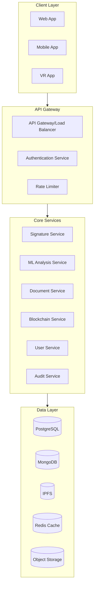

I'll create a comprehensive backend architecture for the signature validation platform. Let's break it down into microservices and APIs.




Now, let's implement the core backend services:

1. First, the API Gateway service:


```typescript
// api-gateway/src/server.ts
import express from 'express';
import cors from 'cors';
import rateLimit from 'express-rate-limit';
import { createProxyMiddleware } from 'http-proxy-middleware';
import jwt from 'jsonwebtoken';

const app = express();

// Middleware
app.use(cors());
app.use(express.json());

// Rate limiting
const limiter = rateLimit({
  windowMs: 15 * 60 * 1000, // 15 minutes
  max: 100 // limit each IP to 100 requests per windowMs
});
app.use(limiter);

// JWT Authentication middleware
const authenticateToken = (req: any, res: any, next: any) => {
  const authHeader = req.headers['authorization'];
  const token = authHeader && authHeader.split(' ')[1];

  if (token == null) return res.sendStatus(401);

  jwt.verify(token, process.env.JWT_SECRET as string, (err: any, user: any) => {
    if (err) return res.sendStatus(403);
    req.user = user;
    next();
  });
};

// Route configurations
const routes = {
  auth: {
    target: 'http://auth-service:3001',
    pathRewrite: {'^/auth': ''}
  },
  signatures: {
    target: 'http://signature-service:3002',
    pathRewrite: {'^/signatures': ''}
  },
  ml: {
    target: 'http://ml-service:3003',
    pathRewrite: {'^/ml': ''}
  }
};

// Setup proxy routes
Object.entries(routes).forEach(([path, config]) => {
  app.use(`/${path}`, authenticateToken, createProxyMiddleware(config));
});

// Health check endpoint
app.get('/health', (req, res) => {
  res.json({ status: 'healthy' });
});

export default app;

```

2. Now, let's create the Signature Service:

```typescript
// signature-service/src/service.ts
import { Storage } from '@google-cloud/storage';
import { IPFSHTTPClient } from 'ipfs-http-client';
import { ethers } from 'ethers';
import mongoose from 'mongoose';

export class SignatureService {
  private storage: Storage;
  private ipfs: IPFSHTTPClient;
  private blockchain: ethers.Contract;

  constructor() {
    this.storage = new Storage();
    // Initialize IPFS and blockchain connections
  }

  async storeSignature(signatureData: Buffer, metadata: any) {
    try {
      // Store original in secure cloud storage
      const filename = `signatures/${Date.now()}-${metadata.userId}`;
      await this.storage.bucket(process.env.BUCKET_NAME).file(filename).save(signatureData);

      // Store hash in IPFS
      const ipfsResult = await this.ipfs.add(signatureData);
      
      // Record on blockchain
      const tx = await this.blockchain.storeSignatureHash(ipfsResult.path, metadata);
      await tx.wait();

      // Store metadata in MongoDB
      const signature = new SignatureModel({
        userId: metadata.userId,
        storageUrl: filename,
        ipfsHash: ipfsResult.path,
        txHash: tx.hash,
        metadata: metadata,
        createdAt: new Date()
      });
      await signature.save();

      return {
        id: signature._id,
        ipfsHash: ipfsResult.path,
        txHash: tx.hash
      };
    } catch (error) {
      console.error('Error storing signature:', error);
      throw error;
    }
  }

  async verifySignature(signatureId: string, compareWith: Buffer) {
    try {
      const signature = await SignatureModel.findById(signatureId);
      if (!signature) throw new Error('Signature not found');

      // Get original signature
      const originalSignature = await this.storage
        .bucket(process.env.BUCKET_NAME)
        .file(signature.storageUrl)
        .download();

      // Send to ML service for comparison
      const mlResult = await fetch(process.env.ML_SERVICE_URL + '/compare', {
        method: 'POST',
        body: JSON.stringify({
          original: originalSignature.toString('base64'),
          compare: compareWith.toString('base64')
        })
      }).then(res => res.json());

      // Record verification attempt
      await VerificationModel.create({
        signatureId,
        result: mlResult.match,
        confidence: mlResult.confidence,
        metadata: mlResult.metadata
      });

      return {
        match: mlResult.match,
        confidence: mlResult.confidence,
        blockchainVerified: true
      };
    } catch (error) {
      console.error('Error verifying signature:', error);
      throw error;
    }
  }
}

// MongoDB Models
const SignatureSchema = new mongoose.Schema({
  userId: String,
  storageUrl: String,
  ipfsHash: String,
  txHash: String,
  metadata: Object,
  createdAt: Date
});

const VerificationSchema = new mongoose.Schema({
  signatureId: String,
  result: Boolean,
  confidence: Number,
  metadata: Object,
  createdAt: { type: Date, default: Date.now }
});

const SignatureModel = mongoose.model('Signature', SignatureSchema);
const VerificationModel = mongoose.model('Verification', VerificationSchema);

```

3. The ML Service for signature analysis:

```python
# ml-service/app.py
from fastapi import FastAPI, File, UploadFile
from tensorflow.keras.models import load_model
import numpy as np
import cv2
from typing import List
import json

app = FastAPI()

class SignatureAnalyzer:
    def __init__(self):
        self.model = load_model('signature_model.h5')
        self.feature_extractor = load_model('feature_extractor.h5')
    
    def preprocess_image(self, image_data: bytes) -> np.ndarray:
        # Convert bytes to image
        nparr = np.frombuffer(image_data, np.uint8)
        img = cv2.imdecode(nparr, cv2.IMREAD_GRAYSCALE)
        
        # Preprocessing steps
        img = cv2.resize(img, (224, 224))
        img = img / 255.0
        return img

    def extract_features(self, image: np.ndarray) -> np.ndarray:
        features = self.feature_extractor.predict(np.expand_dims(image, axis=0))
        return features

    def compare_signatures(self, 
                         original: np.ndarray, 
                         compare: np.ndarray) -> dict:
        # Extract features
        original_features = self.extract_features(original)
        compare_features = self.extract_features(compare)
        
        # Calculate similarity
        similarity = np.dot(original_features, compare_features.T)[0][0]
        
        # Additional analysis
        style_match = self.analyze_style(original, compare)
        pressure_match = self.analyze_pressure(original, compare)
        
        return {
            "match": bool(similarity > 0.95),
            "confidence": float(similarity),
            "metadata": {
                "style_similarity": float(style_match),
                "pressure_similarity": float(pressure_match)
            }
        }

    def analyze_style(self, img1: np.ndarray, img2: np.ndarray) -> float:
        # Analyze writing style characteristics
        # (stroke patterns, angles, curves)
        pass

    def analyze_pressure(self, img1: np.ndarray, img2: np.ndarray) -> float:
        # Analyze pressure patterns using intensity values
        pass

analyzer = SignatureAnalyzer()

@app.post("/compare")
async def compare_signatures(
    original: UploadFile = File(...),
    compare: UploadFile = File(...)
):
    # Read image data
    original_data = await original.read()
    compare_data = await compare.read()
    
    # Preprocess images
    original_img = analyzer.preprocess_image(original_data)
    compare_img = analyzer.preprocess_image(compare_data)
    
    # Compare signatures
    result = analyzer.compare_signatures(original_img, compare_img)
    
    return result

@app.post("/analyze")
async def analyze_signature(signature: UploadFile = File(...)):
    # Read and preprocess image
    signature_data = await signature.read()
    signature_img = analyzer.preprocess_image(signature_data)
    
    # Extract features
    features = analyzer.extract_features(signature_img)
    
    # Analyze characteristics
    characteristics = {
        "complexity": float(np.mean(features)),
        "consistency": float(np.std(features)),
        "uniqueness_score": float(np.max(features))
    }
    
    return characteristics

```

4. Blockchain Integration Service:

```typescript
// blockchain-service/src/service.ts
import { ethers } from 'ethers';
import { redis } from './redis';

export class BlockchainService {
  private provider: ethers.providers.JsonRpcProvider;
  private contract: ethers.Contract;
  
  constructor() {
    this.provider = new ethers.providers.JsonRpcProvider(
      process.env.BLOCKCHAIN_RPC_URL
    );
    
    this.contract = new ethers.Contract(
      process.env.CONTRACT_ADDRESS,
      SignatureABI,
      this.provider
    );
  }

  async recordSignature(
    signatureHash: string,
    metadata: any
  ): Promise<string> {
    try {
      // Create transaction
      const tx = await this.contract.recordSignature(
        signatureHash,
        JSON.stringify(metadata)
      );
      
      // Wait for confirmation
      const receipt = await tx.wait();
      
      // Cache the result
      await redis.set(
        `signature:${signatureHash}`,
        JSON.stringify({
          txHash: receipt.transactionHash,
          blockNumber: receipt.blockNumber,
          timestamp: Date.now()
        })
      );
      
      return receipt.transactionHash;
    } catch (error) {
      console.error('Blockchain recording error:', error);
      throw error;
    }
  }

  async verifySignature(signatureHash: string): Promise<{
    verified: boolean;
    metadata: any;
    timestamp: number;
  }> {
    // Check cache first
    const cached = await redis.get(`signature:${signatureHash}`);
    if (cached) {
      return JSON.parse(cached);
    }

    // Get from blockchain
    const result = await this.contract.getSignature(signatureHash);
    
    return {
      verified: result.exists,
      metadata: JSON.parse(result.metadata || '{}'),
      timestamp: result.timestamp.toNumber()
    };
  }

  async getSignatureHistory(signatureHash: string): Promise<any[]> {
    const events = await this.contract.queryFilter(
      this.contract.filters.SignatureEvent(signatureHash)
    );
    
    return events.map(event => ({
      txHash: event.transactionHash,
      blockNumber: event.blockNumber,
      timestamp: event.args?.timestamp.toNumber(),
      action: event.args?.action
    }));
  }
}

// Smart Contract ABI
const SignatureABI = [
  // ... contract ABI ...
];

```

5. User and Auth Service:

```typescript
// auth-service/src/service.ts
import { hash, compare } from 'bcrypt';
import jwt from 'jsonwebtoken';
import { redis } from './redis';

export class AuthService {
  async createUser(userData: {
    email: string;
    password: string;
    metadata: any;
  }) {
    // Hash password
    const hashedPassword = await hash(userData.password, 10);
    
    // Create user in database
    const user = await UserModel.create({
      email: userData.email,
      password: hashedPassword,
      metadata: userData.metadata
    });

    return this.generateTokens(user._id);
  }

  async login(email: string, password: string) {
    // Find user
    const user = await UserModel.findOne({ email });
    if (!user) throw new Error('User not found');

    // Verify password
    const valid = await compare(password, user.password);
    if (!valid) throw new Error('Invalid password');

    return this.generateTokens(user._id);
  }

  private async generateTokens(userId: string) {
    // Generate access token
    const accessToken = jwt.sign(
      { userId },
      process.env.JWT_SECRET!,
      { expiresIn: '15m' }
    );

    // Generate refresh token
    const refreshToken = jwt.sign(
      { userId },
      process.env.REFRESH_SECRET!,
      { expiresIn: '7d' }
    );

    // Store refresh token
    await redis.set(
      `refresh:${userId}`,
      refreshToken,
      'EX',
      7 * 24 * 60 * 60
    );

    return { accessToken, refreshToken };
  }

  async refreshToken(token: string) {
    try {
      const decoded = jwt.verify(token, process.env.REFRESH_SECRET!);
      const userId = (decoded as any).userId;

      // Verify token in redis
      const storedToken = await redis.get(`refresh:${userId}`);
      if (storedToken !== token) throw new Error('Invalid refresh token');

      return this.generateTokens(userId);
    } catch (error) {
      throw new Error('Invalid refresh token');
    }
  }

  async revokeToken(userId: string) {
    await redis.del(`refresh:${userId}`);
  }
}

// User model definition (using mongoose)
const UserSchema = new mongoose.Schema({
  email: { type: String, unique: true, required: true },
  password: { type: String, required: true },
  metadata: {
    name: String,
    organization: String,
    role: String,
    apiQuota: { type: Number, default: 1000 },
    apiUsage: { type: Number, default: 0 }
  },
  status: {
    type: String,
    enum: ['active', 'suspended', 'pending'],
    default: 'pending'
  },
  lastLogin: Date,
  createdAt: { type: Date, default: Date.now }
});

const UserModel = mongoose.model('User', UserSchema);

```

6. Let's create the Audit Service:

```typescript
// audit-service/src/service.ts
import { Kafka } from 'kafkajs';
import mongoose from 'mongoose';

export class AuditService {
  private kafka: Kafka;

  constructor() {
    this.kafka = new Kafka({
      clientId: 'audit-service',
      brokers: [process.env.KAFKA_BROKER!]
    });
  }

  async logEvent(event: {
    userId: string;
    action: string;
    resource: string;
    status: string;
    metadata: any;
  }) {
    // Store in MongoDB
    await AuditModel.create({
      ...event,
      timestamp: new Date()
    });

    // Publish to Kafka for real-time processing
    const producer = this.kafka.producer();
    await producer.connect();
    await producer.send({
      topic: 'audit-events',
      messages: [
        { value: JSON.stringify(event) }
      ]
    });
  }

  async getAuditTrail(filters: {
    userId?: string;
    action?: string;
    startDate?: Date;
    endDate?: Date;
  }) {
    const query: any = {};
    if (filters.userId) query.userId = filters.userId;
    if (filters.action) query.action = filters.action;
    if (filters.startDate || filters.endDate) {
      query.timestamp = {};
      if (filters.startDate) query.timestamp.$gte = filters.startDate;
      if (filters.endDate) query.timestamp.$lte = filters.endDate;
    }

    return AuditModel.find(query)
      .sort({ timestamp: -1 })
      .limit(1000);
  }

  async generateComplianceReport(startDate: Date, endDate: Date) {
    const events = await AuditModel.aggregate([
      {
        $match: {
          timestamp: { $gte: startDate, $lte: endDate }
        }
      },
      {
        $group: {
          _id: {
            action: '$action',
            status: '$status'
          },
          count: { $sum: 1 }
        }
      }
    ]);

    return {
      timeframe: { startDate, endDate },
      events,
      summary: {
        totalEvents: events.reduce((acc, curr) => acc + curr.count, 0),
        successRate: this.calculateSuccessRate(events)
      }
    };
  }

  private calculateSuccessRate(events: any[]) {
    const total = events.reduce((acc, curr) => acc + curr.count, 0);
    const successful = events
      .filter(e => e._id.status === 'success')
      .reduce((acc, curr) => acc + curr.count, 0);
    
    return (successful / total) * 100;
  }
}

// Audit model definition
const AuditSchema = new mongoose.Schema({
  userId: String,
  action: String,
  resource: String,
  status: String,
  metadata: Object,
  timestamp: Date
});

const AuditModel = mongoose.model('Audit', AuditSchema);

```

7. Docker Compose configuration for orchestration:

```yaml
version: '3.8'

services:
  api-gateway:
    build: ./api-gateway
    ports:
      - "3000:3000"
    environment:
      - JWT_SECRET=${JWT_SECRET}
      - NODE_ENV=production
    depends_on:
      - auth-service
      - signature-service
      - ml-service

  auth-service:
    build: ./auth-service
    environment:
      - MONGODB_URI=${MONGODB_URI}
      - REDIS_URL=${REDIS_URL}
      - JWT_SECRET=${JWT_SECRET}
    depends_on:
      - mongodb
      - redis

  signature-service:
    build: ./signature-service
    environment:
      - STORAGE_BUCKET=${STORAGE_BUCKET}
      - IPFS_NODE=${IPFS_NODE}
      - BLOCKCHAIN_RPC=${BLOCKCHAIN_RPC}
    depends_on:
      - mongodb
      - ipfs

  ml-service:
    build: ./ml-service
    environment:
      - MODEL_PATH=/models
      - CUDA_VISIBLE_DEVICES=0
    volumes:
      - ./models:/models
    deploy:
      resources:
        reservations:
          devices:
            - driver: nvidia
              count: 1
              capabilities: [gpu]

  blockchain-service:
    build: ./blockchain-service
    environment:
      - BLOCKCHAIN_RPC_URL=${BLOCKCHAIN_RPC_URL}
      - CONTRACT_ADDRESS=${CONTRACT_ADDRESS}
    depends_on:
      - redis

  audit-service:
    build: ./audit-service
    environment:
      - KAFKA_BROKER=${KAFKA_BROKER}
      - MONGODB_URI=${MONGODB_URI}
    depends_on:
      - kafka
      - mongodb

  mongodb:
    image: mongo:latest
    volumes:
      - mongodb_data:/data/db

  redis:
    image: redis:alpine
    volumes:
      - redis_data:/data

  ipfs:
    image: ipfs/go-ipfs:latest
    volumes:
      - ipfs_data:/data/ipfs

  kafka:
    image: confluentinc/cp-kafka:latest
    environment:
      KAFKA_ADVERTISED_LISTENERS: PLAINTEXT://kafka:9092
      KAFKA_ZOOKEEPER_CONNECT: zookeeper:2181

  zookeeper:
    image: confluentinc/cp-zookeeper:latest
    environment:
      ZOOKEEPER_CLIENT_PORT: 2181

volumes:
  mongodb_data:
  redis_data:
  ipfs_data:

```

This backend implementation provides:

1. Scalable Microservices Architecture
2. Secure Authentication & Authorization
3. Blockchain Integration
4. ML-based Signature Analysis
5. Comprehensive Audit Trail
6. High Performance with Caching
7. Container Orchestration

Would you like me to expand on:
1. API documentation
2. Deployment strategies
3. Scaling configurations
4. Security measures
5. Testing implementations
