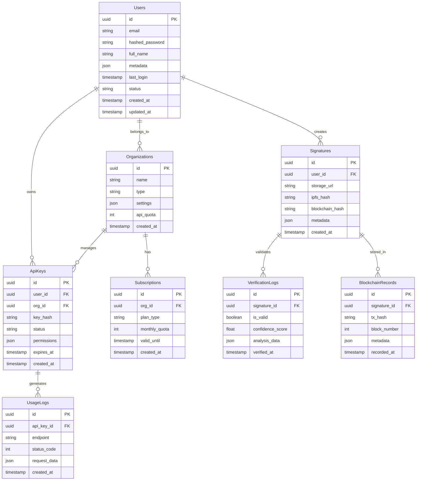

I'll design a comprehensive database schema for the signature validation platform. We'll use a combination of PostgreSQL for structured data and MongoDB for document storage.




Let's implement the PostgreSQL schemas:

```sql
-- Enable UUID extension
CREATE EXTENSION IF NOT EXISTS "uuid-ossp";

-- Users table
CREATE TABLE users (
    id UUID PRIMARY KEY DEFAULT uuid_generate_v4(),
    email VARCHAR(255) UNIQUE NOT NULL,
    hashed_password VARCHAR(255) NOT NULL,
    full_name VARCHAR(255),
    metadata JSONB DEFAULT '{}',
    last_login TIMESTAMP,
    status VARCHAR(50) DEFAULT 'active',
    created_at TIMESTAMP DEFAULT CURRENT_TIMESTAMP,
    updated_at TIMESTAMP DEFAULT CURRENT_TIMESTAMP
);

-- Organizations table
CREATE TABLE organizations (
    id UUID PRIMARY KEY DEFAULT uuid_generate_v4(),
    name VARCHAR(255) NOT NULL,
    type VARCHAR(50) NOT NULL,
    settings JSONB DEFAULT '{}',
    api_quota INTEGER DEFAULT 1000,
    created_at TIMESTAMP DEFAULT CURRENT_TIMESTAMP
);

-- Organization memberships
CREATE TABLE organization_members (
    user_id UUID REFERENCES users(id),
    org_id UUID REFERENCES organizations(id),
    role VARCHAR(50) NOT NULL,
    joined_at TIMESTAMP DEFAULT CURRENT_TIMESTAMP,
    PRIMARY KEY (user_id, org_id)
);

-- API Keys table
CREATE TABLE api_keys (
    id UUID PRIMARY KEY DEFAULT uuid_generate_v4(),
    user_id UUID REFERENCES users(id),
    org_id UUID REFERENCES organizations(id),
    key_hash VARCHAR(255) UNIQUE NOT NULL,
    status VARCHAR(50) DEFAULT 'active',
    permissions JSONB DEFAULT '{}',
    expires_at TIMESTAMP,
    created_at TIMESTAMP DEFAULT CURRENT_TIMESTAMP
);

-- Signatures table
CREATE TABLE signatures (
    id UUID PRIMARY KEY DEFAULT uuid_generate_v4(),
    user_id UUID REFERENCES users(id),
    storage_url VARCHAR(255) NOT NULL,
    ipfs_hash VARCHAR(255),
    blockchain_hash VARCHAR(255),
    metadata JSONB DEFAULT '{}',
    created_at TIMESTAMP DEFAULT CURRENT_TIMESTAMP
);

-- Verification logs
CREATE TABLE verification_logs (
    id UUID PRIMARY KEY DEFAULT uuid_generate_v4(),
    signature_id UUID REFERENCES signatures(id),
    is_valid BOOLEAN NOT NULL,
    confidence_score FLOAT,
    analysis_data JSONB DEFAULT '{}',
    verified_at TIMESTAMP DEFAULT CURRENT_TIMESTAMP
);

-- Blockchain records
CREATE TABLE blockchain_records (
    id UUID PRIMARY KEY DEFAULT uuid_generate_v4(),
    signature_id UUID REFERENCES signatures(id),
    tx_hash VARCHAR(255) NOT NULL,
    block_number INTEGER NOT NULL,
    metadata JSONB DEFAULT '{}',
    recorded_at TIMESTAMP DEFAULT CURRENT_TIMESTAMP
);

-- Subscriptions table
CREATE TABLE subscriptions (
    id UUID PRIMARY KEY DEFAULT uuid_generate_v4(),
    org_id UUID REFERENCES organizations(id),
    plan_type VARCHAR(50) NOT NULL,
    monthly_quota INTEGER NOT NULL,
    valid_until TIMESTAMP NOT NULL,
    created_at TIMESTAMP DEFAULT CURRENT_TIMESTAMP
);

-- Usage logs
CREATE TABLE usage_logs (
    id UUID PRIMARY KEY DEFAULT uuid_generate_v4(),
    api_key_id UUID REFERENCES api_keys(id),
    endpoint VARCHAR(255) NOT NULL,
    status_code INTEGER NOT NULL,
    request_data JSONB DEFAULT '{}',
    created_at TIMESTAMP DEFAULT CURRENT_TIMESTAMP
);

-- Indexes
CREATE INDEX idx_users_email ON users(email);
CREATE INDEX idx_signatures_user_id ON signatures(user_id);
CREATE INDEX idx_verification_logs_signature_id ON verification_logs(signature_id);
CREATE INDEX idx_blockchain_records_signature_id ON blockchain_records(signature_id);
CREATE INDEX idx_usage_logs_api_key_id ON usage_logs(api_key_id);
CREATE INDEX idx_usage_logs_created_at ON usage_logs(created_at);

-- Triggers for updated_at
CREATE OR REPLACE FUNCTION update_updated_at_column()
RETURNS TRIGGER AS $$
BEGIN
    NEW.updated_at = CURRENT_TIMESTAMP;
    RETURN NEW;
END;
$$ language 'plpgsql';

CREATE TRIGGER update_users_updated_at
    BEFORE UPDATE ON users
    FOR EACH ROW
    EXECUTE FUNCTION update_updated_at_column();

-- Views for common queries
CREATE VIEW active_organizations AS
SELECT 
    o.*,
    COUNT(DISTINCT om.user_id) as member_count,
    COUNT(DISTINCT ak.id) as api_key_count
FROM organizations o
LEFT JOIN organization_members om ON o.id = om.org_id
LEFT JOIN api_keys ak ON o.id = ak.org_id
WHERE o.status = 'active'
GROUP BY o.id;

CREATE VIEW api_usage_summary AS
SELECT 
    ak.org_id,
    DATE_TRUNC('day', ul.created_at) as usage_date,
    COUNT(*) as request_count,
    COUNT(DISTINCT ak.id) as active_keys
FROM usage_logs ul
JOIN api_keys ak ON ul.api_key_id = ak.id
GROUP BY ak.org_id, DATE_TRUNC('day', ul.created_at);

-- Functions for common operations
CREATE OR REPLACE FUNCTION get_organization_usage(
    org_id UUID,
    start_date TIMESTAMP,
    end_date TIMESTAMP
) RETURNS TABLE (
    date DATE,
    request_count BIGINT,
    unique_users BIGINT
) AS $$
BEGIN
    RETURN QUERY
    SELECT 
        DATE_TRUNC('day', ul.created_at)::DATE as date,
        COUNT(*) as request_count,
        COUNT(DISTINCT ak.user_id) as unique_users
    FROM usage_logs ul
    JOIN api_keys ak ON ul.api_key_id = ak.id
    WHERE ak.org_id = org_id
    AND ul.created_at BETWEEN start_date AND end_date
    GROUP BY DATE_TRUNC('day', ul.created_at)
    ORDER BY date;
END;
$$ LANGUAGE plpgsql;

```

For MongoDB, let's create schemas for document storage:

```typescript
// mongodb-schemas.ts
import mongoose from 'mongoose';

// Signature Analysis Schema
const SignatureAnalysisSchema = new mongoose.Schema({
  signatureId: {
    type: String,
    required: true,
    index: true
  },
  features: {
    pressure_points: [[Number]],
    stroke_vectors: [[Number]],
    velocity_data: [[Number]],
    complexity_score: Number,
    uniqueness_score: Number
  },
  ml_metadata: {
    model_version: String,
    confidence_scores: Map,
    processing_time: Number
  },
  created_at: {
    type: Date,
    default: Date.now
  }
});

// Audit Trail Schema
const AuditTrailSchema = new mongoose.Schema({
  entity_id: {
    type: String,
    required: true,
    index: true
  },
  entity_type: {
    type: String,
    required: true,
    index: true
  },
  action: {
    type: String,
    required: true
  },
  actor: {
    user_id: String,
    api_key_id: String,
    ip_address: String
  },
  changes: {
    before: Map,
    after: Map
  },
  metadata: {
    browser: String,
    device: String,
    location: {
      ip: String,
      country: String,
      city: String
    }
  },
  timestamp: {
    type: Date,
    default: Date.now,
    index: true
  }
});

// ML Training Data Schema
const MLTrainingDataSchema = new mongoose.Schema({
  signature_pair: {
    original_id: String,
    comparison_id: String
  },
  features: {
    similarity_score: Number,
    feature_vectors: [[Number]],
    match_points: [[Number]]
  },
  validation: {
    is_match: Boolean,
    validator_id: String,
    confidence: Number
  },
  created_at: {
    type: Date,
    default: Date.now
  }
});

// Analytics Data Schema
const AnalyticsDataSchema = new mongoose.Schema({
  organization_id: {
    type: String,
    required: true,
    index: true
  },
  period: {
    start: Date,
    end: Date
  },
  metrics: {
    total_requests: Number,
    unique_users: Number,
    average_response_time: Number,
    error_rate: Number,
    signature_stats: {
      total_signatures: Number,
      valid_signatures: Number,
      invalid_signatures: Number,
      average_confidence: Number
    }
  },
  usage_patterns: {
    hourly_distribution: [Number],
    endpoint_usage: Map,
    error_types: Map
  },
  created_at: {
    type: Date,
    default: Date.now
  }
});

// Create indexes
SignatureAnalysisSchema.index({ created_at: 1 });
AuditTrailSchema.index({ 'actor.user_id': 1, timestamp: 1 });
MLTrainingDataSchema.index({ 'signature_pair.original_id': 1 });
AnalyticsDataSchema.index({ 'period.start': 1, 'period.end': 1 });

// Export models
export const SignatureAnalysis = mongoose.model('SignatureAnalysis', SignatureAnalysisSchema);
export const AuditTrail = mongoose.model('AuditTrail', AuditTrailSchema);
export const MLTrainingData = mongoose.model('MLTrainingData', MLTrainingDataSchema);
export const AnalyticsData = mongoose.model('AnalyticsData', AnalyticsDataSchema);

```

This database design provides:

1. Relational Data (PostgreSQL):
- User and organization management
- API key handling
- Signature metadata
- Verification logs
- Billing and subscriptions

2. Document Storage (MongoDB):
- Signature analysis data
- Detailed audit trails
- ML training data
- Analytics and metrics

Would you like me to add:
1. Additional indexes for optimization
2. More stored procedures
3. Data migration scripts
4. Backup strategies
5. Sharding configuration
