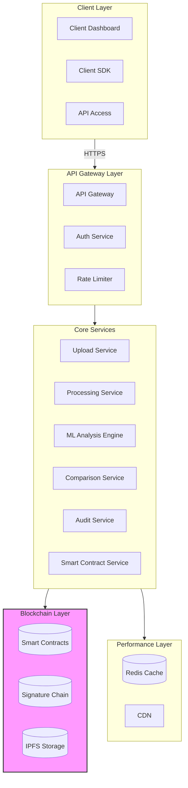

I'll modify the architecture to include blockchain for immutable signature storage and validation records. This ensures each signature verification is tamper-proof and traceable.




Let's implement the blockchain integration:

1. Smart Contract Structure:
```solidity
// SPDX-License-Identifier: MIT
pragma solidity ^0.8.0;

contract SignatureValidation {
    struct Signature {
        bytes32 signatureHash;      // Hash of the signature image
        bytes32 documentHash;       // Hash of the document being signed
        uint256 timestamp;         // When the signature was recorded
        address validator;         // Address of the validating entity
        bool isValid;             // Validation result
    }
    
    mapping(bytes32 => Signature) public signatures;
    
    event SignatureValidated(
        bytes32 indexed signatureId,
        bytes32 signatureHash,
        bool isValid,
        uint256 timestamp
    );
    
    function validateSignature(
        bytes32 signatureId,
        bytes32 signatureHash,
        bytes32 documentHash,
        bool validationResult
    ) public {
        signatures[signatureId] = Signature({
            signatureHash: signatureHash,
            documentHash: documentHash,
            timestamp: block.timestamp,
            validator: msg.sender,
            isValid: validationResult
        });
        
        emit SignatureValidated(
            signatureId,
            signatureHash,
            validationResult,
            block.timestamp
        );
    }
}
```

2. Key Components Added:

```typescript
// Blockchain Integration Service
class BlockchainService {
    // Store signature validation result
    async storeValidation(
        signatureImage: Buffer,
        documentHash: string,
        validationResult: boolean
    ): Promise<string> {
        // 1. Store signature image in IPFS
        const ipfsHash = await this.ipfs.add(signatureImage);
        
        // 2. Create signature validation record
        const signatureId = ethers.utils.id(ipfsHash + documentHash);
        
        // 3. Call smart contract
        const tx = await this.contract.validateSignature(
            signatureId,
            ipfsHash,
            documentHash,
            validationResult
        );
        
        await tx.wait();
        return signatureId;
    }
    
    // Verify signature record
    async verifyRecord(signatureId: string): Promise<{
        isValid: boolean;
        timestamp: number;
        validator: string;
    }> {
        const record = await this.contract.signatures(signatureId);
        return {
            isValid: record.isValid,
            timestamp: record.timestamp.toNumber(),
            validator: record.validator
        };
    }
}
```

3. Updates to the UI:


```tsx
import React, { useState } from 'react';
import { Card, CardContent, CardHeader, CardTitle } from '@/components/ui/card';
import { Button } from '@/components/ui/button';
import { Alert, AlertDescription } from '@/components/ui/alert';
import { CheckCircle, Upload, RefreshCw, Camera, Link } from 'lucide-react';

const BlockchainSignatureValidator = () => {
  const [step, setStep] = useState(1);
  const [isProcessing, setIsProcessing] = useState(false);
  const [blockchainRecord, setBlockchainRecord] = useState(null);

  const handleVerify = async () => {
    setIsProcessing(true);
    // Simulate blockchain verification
    setTimeout(() => {
      setIsProcessing(false);
      setBlockchainRecord({
        signatureId: "0x1234...5678",
        timestamp: Date.now(),
        isValid: true,
        blockNumber: 12345678
      });
      setStep(3);
    }, 2000);
  };

  return (
    <div className="min-h-screen bg-gray-50 p-4 flex items-center justify-center">
      <Card className="w-full max-w-2xl">
        <CardHeader>
          <CardTitle className="text-3xl text-center text-blue-600">
            Blockchain Signature Checker
          </CardTitle>
        </CardHeader>
        <CardContent className="space-y-6">
          {/* Result with Blockchain Verification */}
          {blockchainRecord && (
            <div className="space-y-4">
              <Alert className="bg-green-50 border-green-200">
                <AlertDescription className="text-xl text-center text-green-600 py-4">
                  ✓ Signature Verified on Blockchain
                </AlertDescription>
              </Alert>
              
              <Card className="bg-gray-50">
                <CardContent className="p-4 space-y-2">
                  <div className="text-lg">
                    <span className="font-semibold">Transaction ID:</span>
                    <br />
                    <span className="font-mono text-sm">{blockchainRecord.signatureId}</span>
                  </div>
                  
                  <div className="text-lg">
                    <span className="font-semibold">Block Number:</span>
                    <br />
                    <span className="font-mono">{blockchainRecord.blockNumber}</span>
                  </div>
                  
                  <div className="text-lg">
                    <span className="font-semibold">Timestamp:</span>
                    <br />
                    <span>{new Date(blockchainRecord.timestamp).toLocaleString()}</span>
                  </div>
                </CardContent>
              </Card>

              <Button 
                className="w-full text-lg h-16"
                onClick={() => window.print()}
              >
                <Link className="mr-2" size={24} />
                Save Verification Report
              </Button>
            </div>
          )}

          {/* Main Verification Button */}
          {!blockchainRecord && (
            <Button 
              size="lg"
              className="w-full h-24 text-xl"
              onClick={handleVerify}
            >
              <CheckCircle size={32} className="mr-2" />
              Verify on Blockchain
            </Button>
          )}

          {/* Processing Indicator */}
          {isProcessing && (
            <div className="fixed inset-0 bg-black/50 flex items-center justify-center">
              <Card className="w-64">
                <CardContent className="p-6">
                  <div className="flex flex-col items-center gap-4">
                    <RefreshCw size={48} className="animate-spin text-blue-600" />
                    <div className="text-xl text-center">
                      Recording on Blockchain...
                    </div>
                  </div>
                </CardContent>
              </Card>
            </div>
          )}
        </CardContent>
      </Card>
    </div>
  );
};

export default BlockchainSignatureValidator;

```

4. Benefits of Blockchain Integration:

- Immutable Record: Each signature verification is permanently recorded
- Transparency: Anyone can verify the signature's authenticity
- Audit Trail: Complete history of all verifications
- Decentralized Storage: Signatures stored on IPFS with hashes on chain
- Smart Contract Security: Automated validation rules
- Timestamping: Proof of when each verification occurred

5. Technical Considerations:

- Using Ethereum for smart contracts
- IPFS for storing signature images
- Layer 2 solution (like Polygon) for lower transaction costs
- Local caching for performance
- Multiple blockchain node providers for reliability

Would you like me to elaborate on any part of the blockchain integration? I can provide more details about:
1. Smart contract security measures
2. IPFS configuration
3. Gas optimization strategies
4. Additional blockchain features
